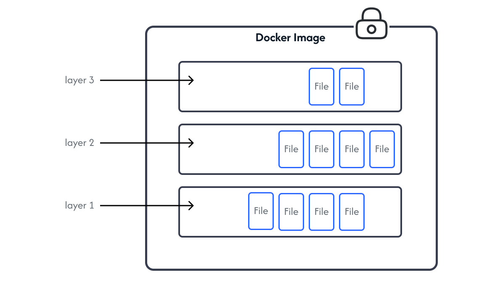

# Docker : The theoretical stuff

Docker came up with a concept to replace virtual machines. mainly it solves the problem of “it works on my machine” by building an entity independent of the OS to run or deploy applications.

### **What is containerization?**

> Containerization is the packaging of software code with just the operating system (OS) libraries and dependencies required to run the application, creating a single lightweight executable — called a **container** — that runs consistently on any infrastructure.
> 

### What is Docker?

in simple terms :

> Docker runs and manages applications using **process isolation techniques**, by performing system-level virtualization, also known as **containerization**.
> 

meaning, it’s main purpose is to run an application in an environment independent of the host OS. inside an entity with a **standalone software executable package** that contains only the elements necessary to run the application. All this is done by the container engine.

### Docker architecture :

**Orchestration** is a big topic and it is not discussed in this article.

**Docker engine:** The Docker engine is the core software that runs and manages containers, it is made from many specialized tools that work together to create and run containers (APIs, execution driver, runtimes, shims…).

The major components that make up the Docker engine are :

- The Docker daemon.
- Runtime (containerd + shim + runc).

**daemon:** the major functionality of the daemon includes : image management, image builds, the REST API, authentication, security, core networking, and orchestration.

**containerd:** the purpose of containerd is to manage containers lifecycle operations — start | stop | pause | rm .… as well managing image pulls, volumes and networks.

**runc:** is lightweight CLI tool, and very low-level binary that has a single purpose in life is creating containers. it directly interacts with the Linux kernel's features such as namespaces and cgroups.

**namespaces** : they slice up the operating system so that it looks like multiple isolated systems. Docker on linux currently uses the following kernel name spaces :

- *Process ID namespace:* provides process tree isolation.
- *Network namespace:* provides network isolation, each container has a network stack including Interfaces, IP addresses, port ranges and routing tables.
- *Mount namespace:* provides an isolated root (/) filesystem.
- *Inter-process Communication namespace:* provides an isolated shared memory access.
- *User namespace:* provides user mapping, it allow users to run containers as root inside the container while running as a regular user on the host.
- *UTS namespace:* provides each container with its own isolated hostname.

A container can be defined as a collection of namespaces packaged and ready to use.

**cgroups** : Container are isolated but they all use the same set of OS resources, things like CPU, RAM… cgourps provide a way to set limits of how much a container can consume.

### How containers are created ?

First thing to note is that Docker is composed of the **client** and the **server**, which can be on the same host machine connecting over a socket, or they can on different machines connected over a network. the sever contains the Docker daemon and implements the a Rest API that connects to the client, the client is basically the Docker CLI, its job is to convert the commands typed into the CLI and convert them into the appropriate API payload and POSTs them to the API endpoint exposed by the docker deamon.

Once the daemon receives the command, it makes a call to the containerd over an API (gRPC). containerd does not directly create containers, it uses runc to do that, it forks a new instance of runc for every container, runc interfaces with the OS kernel to pull together all of the constructs necessary to create a container (namespaces, cgroups etc.). The container process is started as a child-process of runc, and as soon as it is started runc will exit.

**shim:** it’s called *containerd-shim,* it is a process associated with avery container, once the runc exits, the containerd-shim becomes the container’s parent. it is responsible for :

- keeping STDIN and STDOUT streams open so that when the daemon is restarted, the container doesn’t terminate due to pipes being closed etc.
- Reports the container’s exit status back to the daemon.

On a Linux system, the componants are implemented as seperate binaries as follows:

- ***dockerd* (the Docker daemon)**
- ***docker-containerd* (containerd)**
- ***docker-containerd-shim* (shim)**
- ***docker-runc* (runc)**

### client and Daemon communication is not secured over HTTP :?

The connection client-server ocuurs over an unsecured HTTP socket on port 2375/tcp. Docker lets you force the client and daemon to only accept network connections that are secured with TLS.

Securing the client forces the client to only connect to Docker daemons with certificates signed by a trusted Certificate Authority (CA) — **client mode** — . Securing the daemon forces the daemon to only accept connections from clients presenting certificates from a trusted CA — **daemon mode** —. A combination of both modes offers the most security.

### What is a Docker image ?

> An image is an object that contains everything an application needs to run. This includes; **application code**, **application dependencies**, and **OS constructs**. you can think of them as similar to a class.
> 

The most important property of a Docker images is that are usually small and lightweight, the whole purpose of a container is to run a single application or a service, This means it only needs the code and dependencies of the app/service it is running, nothing else.

Images don’t contain a kernel. The containers share the host’s kernel. therefore images contain just OS-related files and filesystem objects. they’re stripped of most non-essential parts.

Docker images are hosted in an image registry, the most common is **Docker Hub**. you can pull an image and run it as a container.

Docker Hub has the concept of **official repositories** and **unofficial repositories**.

**official repositories** contain up-to-date, high-quality, secure, and well-documented images.

**unofficial repositories** contain personal image that live in the wild west created by users like you and me. and they should not be trusted.

They can be distinguished by the naming

- **official repositories :** <repository_name>:<tag>
- **unofficial repositories :** <username>/<repository_name>:<tag>

A Docker image is just a bunch of loosely-connected read-only **layers**, with each layer comprising one or more files. Docker takes care of stacking these layers and representing them as a single unified object.

Use `docker image inspect` to see the layers of an image. or use `dive` for a detailed representation.

When updating image new file are added and new layers are created.

Multiple image can and do share layers. for space efficiency. Docker implements a storage driver that make it smart enough to support image layering and layer sharing and other features.

Image version can tagged to distinguish release versions. in case of two different version having the same tag, yes it can happen, each image version has a unique sha256 hash called **digest** that differentiates it from other version.

An important thing to note is that **latest** is just another arbitrary tag and it doesn’t always point to the newest version.

### What is a Docker container ?

> A container is the runtime instance of an image. and because they only include software and dependencies required by the application They are faster and more lightweight.
> 

You can run multiple containers from a single image.

To fully understand containers, We need to understand the differences between a container and a virtual machine. Both types need a Host to run on.

**In VMs :** the hypervisor sits on top of the physical layer, once booted, it claims all physical resources; **CPU, RAM, storage…** and carves them into virtual version, and packages them into a software constructs called VMs. I like to think about it as virtually dividing the hardware into smaller parts, then we install an Operating System on each of them.

**In Containers:** The host runs a single OS with a container engine installed on top. When active, the engine claims software resources—**process tree, filesystem, network stack, etc.**—and divides them into isolated constructs called containers. Think of it as virtually dividing the software into smaller segments. Within each container, we then run a specific application.

The key difference lies in the number of operations required to construct the final product, which directly impacts the time taken.

A VM needs to claim its OS, initialize it, and mange all the virtual resources. plus, The OS comes fully equipped with everything, including 6 shells that you don’t even need :| , If you have multiple VMs, each one will needs is own management like upgrading and licensing…

For containers, this process is streamlined. The host handles everything once, utilizing a single kernel. We only need to run the application code within the container.

This significantly impacts start-up times, making containers much faster to launch than VMs.

### What is a Docker Network ?

The core property of a container is that it’s completely isolated, Docker networking therefore gives a solution to container-to-container communication.

Docker network is based on the Container Network Model CNM written in Go called *libnetwork*, CNM provides design specification and the fundamental building blocks of a Docker network.

It defines three major building blocks:

- **Sandboxes** : is an isolated network stack. It includes; Ethernet interfaces, ports, routing tables, and DNS config.
- **Endpoints :** a virtual network interfaces that ****connects a sandbox to a network.
- **Networks :** are a software implementation of a switch. As such, they group together and isolate a collection of endpoints that need to communicate.

A container can have multiple endpoints connected to different networks.

Docker ships with several built-in drivers (Network types), that are responsible for the connectivity and isolation, and the actual network creation.

Libnetwork includes the following driver packages (null, bridge, overlay and remote).

Docker supports multiple types of networks.

- **The default bridge :** the default single-host bridge network, this one is built-in and should not be used. and it does not support name resolution via the Docker DNS service.
- **The user-defined bridge :** the network suited for single-host containers and does support name resolution via the Docker DNS service.
- **The host :** the container runs as a regular application on the host (no isolation).
- **macVLAN :** the containers get their own mac address and ip address and they are directly connected to the internet, but promiscuous mode has to be used. and supports no DHCP.
- **IPVLAN :** the containers connect directly to your home network, gets its own ip address and uses the same mac address as the host network.
- **overlay** : used with docker swarm when running containers on multiple hosts.
- **NONE :** used only in cases where no networking is desired.

Containers are by default connected to the default bridge network.

### What is a Docker Volume ?

there are two main categories of data; persistent and non-persistent. Docker has a solution for both. non-persistent data called *local storage* gets its non-persistent storage that is a layer of writable storage created when the container is created and deleted when the container is deleted. and is it entangled to the lifecycle of the container. Docker stores persistent data in an object called *volume*. volumes are independant of containers and they’re managed separately.

- Volumes are independent objects that are not tied to the lifecycle of a container.
- Volumes can be mapped to specialized external storage systems.
- Volumes enable multiple containers on different Docker hosts to access and share the same data.

Volumes are mounted into a directory in the container’s filesystem. anything written to that directory is stored in the volume where data persists.

Volume data on the host by default is located in `/var/lib/docker/volumes/`  and they are mounted to containers, it’s up to you to specify the location on the container.

### Other interesting topics :

- Docker swarms
- kubernetes
- Docker overlay networking
- Docker stacks
- Docker security
