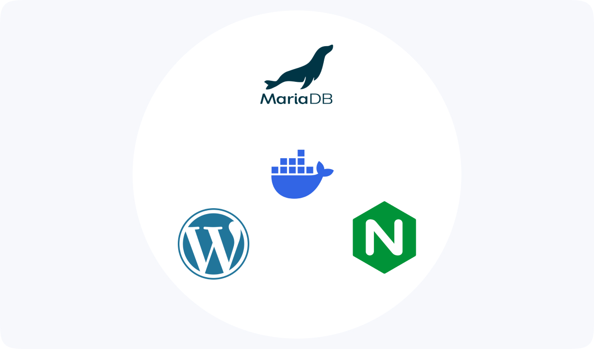
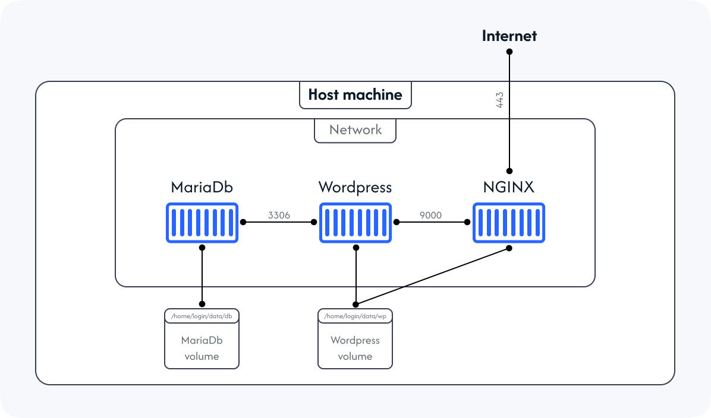

# Inception

You can checkout [Docker The theoretical stuff](Docker-The-theoretical-stuff.md)

And you can also check [Docker The thechnical stuff](cheat-sheet.md)

# 42 Inception: MariaDb + WordPress + NGINX + bonus



This project is designed to introduce you to the fundamentals of Docker and help you build a small infrastructure using containers. We'll be setting up a basic architecture with several services, allowing you to get hands-on experience with Docker concepts and configurations.



# NGINX :

NGINX is a high-performance web server, reverse proxy server, and load balancer. It's widely used to serve web content, handle large volumes of concurrent connections, and efficiently distribute network traffic. Nginx is known for its speed, stability, and resource efficiency, making it a popular choice for handling web traffic.

NGINX should be configured according to the application requirements and the content that is to be served. In our case it should serve the content managed by wordpress and PHP-FPM. We shall configure it to do just that.

### Dockerfile :

```docker
FROM debian:bullseye
RUN apt-get update -y && apt-get upgrade -y
RUN apt-get install -y nginx openssl
COPY ./conf/nginx.conf /etc/nginx/nginx.conf
COPY ./tools/setup.sh /setup.sh
RUN chmod +x /setup.sh
ENTRYPOINT [ "/setup.sh" ]
```

The following script will be used to setup nginx.

```bash
#!/bin/bash

cat <<EOF > /etc/nginx/nginx.conf
user www-data;
events {}
http {
    include /etc/nginx/mime.types;

    server {
        listen 443 ssl;
        root /var/www/html;
        server_name ${INCEPTION_LOGIN}.42.fr;
        index index.php;

        ssl_certificate /etc/nginx/ssl/inception.crt;
        ssl_certificate_key /etc/nginx/ssl/inception.key;
        ssl_protocols TLSv1.2 TLSv1.3;

        location ~ \.php$ {
            include snippets/fastcgi-php.conf;
            fastcgi_pass wordpress:9000;
        }
    }
}
EOF

mkdir -p /etc/nginx/ssl
chown -R www-data:www-data /var/www/html
openssl req -x509 -nodes -days 365 -newkey rsa:2048 \
    -keyout /etc/nginx/ssl/inception.key \
    -out /etc/nginx/ssl/inception.crt \
    -subj "/C=MO/ST=KH/O=42/OU=42/CN=${INCEPTION_LOGIN}.42.fr"
nginx -g "daemon off;"
```

# WordPress : using the WP-CLI

`WC-CLI` is a command line tool for managing self hosted WordPress installations, it is designed for speed, efficiency, enhanced control, improved security and task automation and more. WP-CLI is designed to work with wordpress 3.7 or later and requires PHP 5.6 o later.

### Dockerfile :

```docker
FROM debian:bullseye
RUN apt-get update -y && apt-get upgrade -y
RUN apt-get install -y curl php php-mysql php7.4-fpm mariadb-client
COPY ./tools/setup.sh /
RUN chmod +x /setup.sh
ENTRYPOINT [ "/setup.sh" ]
```

The following script will be used to configure wordpress.

```bash
#!/bin/bash

curl -O https://raw.githubusercontent.com/wp-cli/builds/gh-pages/phar/wp-cli.phar
chmod +x wp-cli.phar && mv wp-cli.phar /usr/local/bin/wp
cd /var/www/html
chmod -R 755 /var/www/html
sed -i '36 s/\/run\/php\/php7.4-fpm.sock/9000/' /etc/php/7.4/fpm/pool.d/www.conf

wait_for_mariadb() {
    until mariadb -h mariadb -P 3306 \
		-u "${INCEPTION_MYSQL_USER}" \
		-p"${INCEPTION_MYSQL_PASS}" -e "SELECT 1"; do
        sleep 2
    done
}
wait_for_mariadb

wp core download --allow-root
wp config create \
	--dbname=${INCEPTION_MYSQL_DATABASE} \
	--dbuser=${INCEPTION_MYSQL_USER} \
	--dbpass=${INCEPTION_MYSQL_PASS} \
	--dbhost=mariadb:3306 --allow-root
wp core install \
	--url=${INCEPTION_DOMAIN_NAME} \
	--title=${INCEPTION_WP_TITLE} \
	--admin_user=${INCEPTION_WP_A_NAME} \
	--admin_password=${INCEPTION_WP_A_PASS} \
	--admin_email=${INCEPTION_WP_A_EMAIL} --allow-root
wp user create ${INCEPTION_WP_U_NAME} ${INCEPTION_WP_U_EMAIL} \
	--user_pass=${INCEPTION_WP_U_PASS} \
	--role=${INCEPTION_WP_U_ROLE} --allow-root

wp theme install twentytwentyfour --activate --allow-root

wp config set WP_CACHE 'true' --allow-root
wp plugin install redis-cache --activate --allow-root
wp config set WP_REDIS_HOST redis --allow-root
wp config set WP_REDIS_PORT 6379 --raw --allow-root
wp redis enable --allow-root

chown -R www-data:www-data /var/www/html

mkdir -p /run/php
/usr/sbin/php-fpm7.4 -F
```

# MariaDb :

The wordpress installation needs database, in this case mariadb.

### Dockerfile :

```docker
FROM debian:bullseye
RUN apt-get update -y && apt-get upgrade -y
RUN apt-get install -y mariadb-server
COPY ./tools/setup.sh /setup.sh
RUN chmod +x /setup.sh
ENTRYPOINT [ "/setup.sh" ]
```

The following script will be used to configure the database for wordpress.

```bash
#!/bin/bash

service mariadb start
# create database
mariadb -e "CREATE DATABASE IF NOT EXISTS ${INCEPTION_MYSQL_DATABASE}"
# create user
mariadb -e "CREATE USER IF NOT EXISTS '${INCEPTION_MYSQL_USER}'@'%' IDENTIFIED BY '${INCEPTION_MYSQL_PASS}'"
# give privileges to the user
mariadb -e "GRANT ALL ON ${INCEPTION_MYSQL_DATABASE}.* TO '${INCEPTION_MYSQL_USER}'@'%';"
# flush privileges
mariadb -e "FLUSH PRIVILEGES;"
# configure mariadb to accept connection from any host
sed -i 's/bind-address            = 127.0.0.1/bind-address            = 0.0.0.0/g' /etc/mysql/mariadb.conf.d/50-server.cnf
# shut down and start server daemon, configure it to accept connections through port 3306
mysqladmin -u root shutdown
mysqld --port=3306 --user=root
```

# Redis-cache :

Redis is an in-memory database that is also refered to as a data structure server. It provides fast access to data that is frequently accessed in form of data structures via a set of commands using a server-client communication model with TCP sockets. Our goal is to configure wordpress to use a redis database for cache management in a seperate container.

### Dockerfile :

```docker
FROM debian:bullseye
RUN apt-get update -y && apt-get upgrade -y
RUN apt-get install -y redis-server
COPY ./tools/setup.sh /setup.sh
RUN chmod +x /setup.sh
ENTRYPOINT [ "/setup.sh" ]
```

The following script will be used to configure the redis-cache database server for wordpress.

```bash
#!/bin/bash

sed -i 's/bind 127.0.0.1/bind 0.0.0.0/g' /etc/redis/redis.conf
echo <<EOF
maxmemory 256mb
maxmemory-policy allkeys-lfu
EOF
redis-server --protected-mode no
```

# FTP (File Transfer Protocol) server :

FTP is a standard network protocol used to transfer files between a client and a server. With an FTP server, you can easily upload or download files, making it essential for sharing large amounts of data over the internet or a private network.

In our case we need set up server pointing to the wordpress volume so that we can upload and download files.

```docker
FROM debian:bullseye
RUN apt-get update -y && apt-get upgrade -y
RUN apt-get install -y vsftpd ftp
COPY ./tools/setup.sh /setup.sh
RUN chmod +x /setup.sh
ENTRYPOINT [ "/setup.sh" ]
```

The following script will be used to configure the FTP server.

```bash
#!/bin/bash

mkdir -p /var/run/vsftpd/empty

cat <<EOF > /etc/vsftpd.conf
# run in standalone mode (listen for incomming connections on an IP and a port)
listen=YES
# require a user to login
anonymous_enable=NO
# permits local users in /etc/passwd logins
local_enable=YES
# enable file upload
write_enable=YES
# file permissions for newly user created files = 777(default) - 022(umask)
local_umask=022
# log upoads and downloads
xferlog_enable=YES
# limit users to their home directory
chroot_local_user=YES
allow_writeable_chroot=YES
pasv_enable=YES
pasv_address=${INCEPTION_IP}
pasv_min_port=30000
pasv_max_port=30009
local_root=/var/www/html
secure_chroot_dir=/var/run/vsftpd/empty
# http://vsftpd.beasts.org/vsftpd_conf.html
EOF

useradd -m -d /var/www/html "${INCEPTION_FTP_USER}"
echo "${INCEPTION_FTP_USER}:${INCEPTION_FTP_PASS}" | chpasswd
chown -R "${INCEPTION_FTP_USER}:${INCEPTION_FTP_USER}" /var/www

exec /usr/sbin/vsftpd
```

# Static website :

I created a simple website with html, css and js that will served using an nginx webserver.

### Dockerfile :

```bash
FROM debian:bullseye
RUN apt-get update -y && apt-get upgrade -y
RUN apt-get install -y nginx openssl
COPY ./tools/website /var/www/html
COPY ./conf/nginx.conf /etc/nginx/nginx.conf
COPY ./tools/setup.sh /
RUN chmod +x /setup.sh
ENTRYPOINT [ "/setup.sh" ]
```

The following script will be used to setup nginx.

```bash
#!/bin/bash

cat <<EOF > /etc/nginx/nginx.conf
events {}
http {
    include /etc/nginx/mime.types;

    server {
        listen 1200 ssl;
        root /var/www/html;
        server_name ${INCEPTION_LOGIN}.42.fr;
        index index.html;

        ssl_certificate /etc/nginx/ssl/inception.crt;
        ssl_certificate_key /etc/nginx/ssl/inception.key;
        ssl_protocols TLSv1.2 TLSv1.3;
    }
}
EOF

mkdir -p /etc/nginx/ssl
chown -R www-data:www-data /var/www/html
openssl req -x509 -nodes -days 365 -newkey rsa:2048 \
    -keyout /etc/nginx/ssl/inception.key \
    -out /etc/nginx/ssl/inception.crt \
    -subj "/C=MO/ST=KH/O=42/OU=42/CN=${INCEPTION_LOGIN}.42.fr"
nginx -g "daemon off;"
```

# Adminer :

Adminer is a single php file application that is easy to deploy and provides a simple web interface for easy access. and supports multiple database management systems, including MySQL, MariaDB, PostgreSQL, SQLite, MS SQL, and others.

```docker
FROM debian:bullseye
RUN apt-get update -y && apt-get upgrade -y
RUN apt-get install -y wget php php-mysqli
COPY ./tools/setup.sh /setup.sh
RUN chmod +x /setup.sh
ENTRYPOINT [ "/setup.sh" ]
```

The following script will be used to setup adminer.

```bash
mkdir -p /var/www/html
chown -R www-data:www-data /var/www/html
wget https://github.com/vrana/adminer/releases/download/v4.8.1/adminer-4.8.1.php -O /var/www/html/index.php
php -S 0.0.0.0:8000 -t /var/www/html
```

# rsync :

rsync is a powerful command-line utility for efficiently copying and synchronizing files and directories between two locations. It’s widely used for backups, mirroring directories, and transferring files over a network. This extra service is container meant to provide backups for the application. It is scheduled to take a snapshot of the files in the wordpress volume as well as the database volume in a newly created volume using crontab.

### Dockerfile :

```bash
FROM debian:bullseye
RUN apt-get update -y && apt-get upgrade -y
RUN apt-get install -y cron rsync mariadb-client
COPY ./tools/setup.sh /setup.sh
COPY ./tools/backup.sh /backup.sh
RUN chmod +x /setup.sh && chmod +x /backup.sh
ENTRYPOINT [ "/setup.sh" ]
```

The following script will be used to take backup the website data.

```bash
rm -rf /home/backup/wordpress/*
mkdir -p /home/backup/wordpress /home/backup/database
rsync -a /var/www/html/ /home/backup/wordpress/
mysqldump -h mariadb -P 3306 -u $INCEPTION_MYSQL_USER -p$INCEPTION_MYSQL_PASS $INCEPTION_MYSQL_DATABASE > /home/backup/database/db_backup.sql
```

The following script will be used to setup crontab.

```bash
cron_job="0 8 * * 1 /backup.sh"
{ env | grep MYSQL; echo "$cron_job"; } | crontab -
cron -f
```

# Compose file :

```docker
services:
  nginx:
    build: requirements/nginx
    container_name: nginx
    image: nginx:tar
    env_file:
      - .env
    depends_on:
      - wordpress
    ports:
      - target: 443
        published: 443
    volumes:
      - wordpress:/var/www/html
    networks:
      - inception
    restart:
      always

  mariadb:
    build: requirements/mariadb
    container_name: mariadb
    image: mariadb:tar
    env_file:
      - .env
    volumes:
      - db:/var/lib/mysql
    networks:
      - inception
    restart:
      always

  wordpress:
    build: requirements/wordpress
    container_name: wordpress
    image: wordpress:tar
    env_file:
      - .env
    depends_on:
      - mariadb
    volumes:
      - wordpress:/var/www/html
    networks:
      - inception
    restart:
      always

  redis:
    build: requirements/bonus/redis
    container_name: redis
    image: redis:tar
    networks:
      - inception
    restart:
      always

  ftp:
    build: requirements/bonus/ftp
    container_name: ftp
    image: ftp:tar
    env_file:
      - .env
    ports:
      - "21:21"
      - "30000-30009:30000-30009"
    volumes:
      - wordpress:/var/www/html
    networks:
      - inception
    restart:
      always

  static:
    build: requirements/bonus/static
    container_name: static
    image: static:tar
    env_file:
      - .env
    ports:
      - target: 1200
        published: 1200
    restart:
      always

  adminer:
    build: requirements/bonus/adminer
    container_name: adminer
    image: adminer:tar
    ports:
      - target: 8000
        published: 8000
    networks:
      - inception
    restart:
      always

  rsync:
    build: requirements/bonus/rsync
    container_name: rsync
    image: rsync:tar
    env_file:
      - .env
    volumes:
      - wordpress:/var/www/html
      - rsync:/home/backup/
    networks:
      - inception
    restart:
      always

volumes:
  wordpress:
    name: wordpress
    driver: local
    driver_opts:
      type: bind
      o: bind
      device: "/home/${INCEPTION_LOGIN}/data/wordpress"
  db:
    name: db
    driver: local
    driver_opts:
      type: bind
      o: bind
      device: "/home/${INCEPTION_LOGIN}/data/database"

  rsync:
    name: rsync
    driver: local
    driver_opts:
      type: bind
      o: bind
      device: "/home/${INCEPTION_LOGIN}/data/backup"

networks:
  inception:
    name: inception
    driver: bridge
```

### Envirement variables :

```bash
INCEPTION_LOGIN=login
INCEPTION_IP=---.---.---.---
INCEPTION_MYSQL_USER=sql_user
INCEPTION_MYSQL_PASS=passcode
INCEPTION_MYSQL_DATABASE=sql_database
INCEPTION_DOMAIN_NAME=https://login.42.fr
INCEPTION_WP_TITLE=title
INCEPTION_WP_A_NAME=admin_name
INCEPTION_WP_A_PASS=passcode
INCEPTION_WP_A_EMAIL=email@gmail.com
INCEPTION_WP_U_NAME=user_name
INCEPTION_WP_U_PASS=passcode
INCEPTION_WP_U_EMAIL=email@gmail.com
INCEPTION_WP_U_ROLE=author
INCEPTION_FTP_USER=ftp_user
INCEPTION_FTP_PASS=passcode
```
