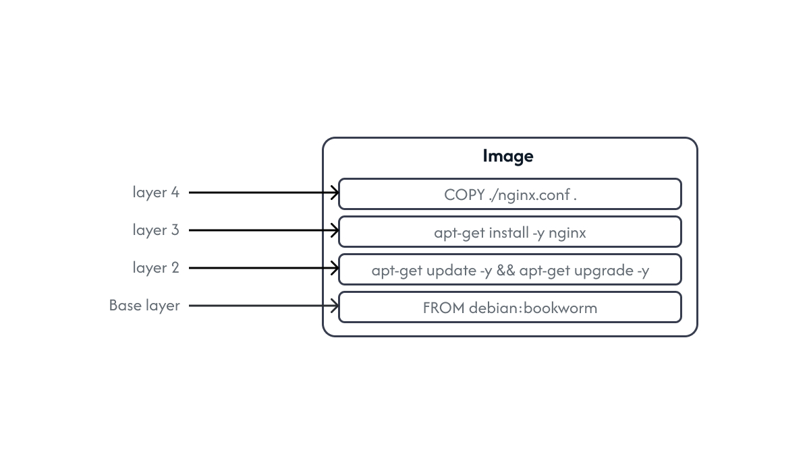

# Docker: The technical stuff


## How to install Docker on Linux ?

To install Docker on Linux simply read and follow the instructions inside the script provided at **https://get.docker.com** to automatically install Docker. Or simply run the following commands.

```bash
curl -fsSL https://get.docker.com -o install-docker.sh
sh install-docker.sh --dry-run
sudo sh install-docker.sh
```

### Running without sudo :

running the Docker binary requires sudo privileges. We can get around this by adding our user to the docker group.

```bash
sudo usermod -aG docker username
```

This command will create the docker group, if it doesn’t exist already, and add the current user to it.

You’ll also need to restart the Docker service. or reboot the system.

```bash
sudo service docker restart
```

# Docker commands :

### The docker pull command :

```bash
docker pull image:tag
```

This will pull the specified image to your docker host.

### The docker image command :

```bash
docker image COMMAND
```

this command is responsible for managing the images.

To list the images available inside your host :

```bash
docker image ls
```

or just use :

```bash
docker images
```

To pull an image from an Docker Hub:

```bash
docker image pull imagename:imagetag
```

To remove an image from your host :

```bash
docker image rm imagename
```

You can use `--force` or just `-f` to forcely remove it.

To remove unused images :

```bash
docker image prune
```

to inspect and see information about an image :

```bash
docker image inspect imagename
```

It also includes layers, to see a visual representation of the file system inside an image you can use a tool called `dive` , to install it :

```bash
brew install dive
```

then run :

```bash
dive imagename
```

### The docker run command :

```bash
Usage: docker run [OPTIONS] IMAGE [COMMAND] [ARG...]
```

this command is responsible for launching the containers.

### Running a simple command inside a container :

```bash
docker run ubuntu echo "Hello World"
```

`ubuntu` is the name of the image that we which to use, followed by the command that will be executed inside the container.

it will you first that you do not have a local copy of the ubuntu image, Docker then checks Docker Hub for the newest version and downloads it. once it is downloaded, Docker then turns the image into a running container and executes the command inside it.

If you run it again you should see only the output of the command specified.

After executing the command, the container will exit. **“containers only run as long as their main process”**.

to enter and maintain the shell, use  `--interactive —tty` options, or just `-i -t` .

to run the container in the Background use `—-detach` option or just `-d`.

to give a container hostname use `—-hostname` option or just `-h` .

to give the container a name use `--name` option.

### The docker container command :

In the following commands, the `container` keyword can be omited.

```bash
docker container COMMAND
```

to list running containers.

```bash
docker container ps
```

to see all containers including exited ones, use `—-all` option, or just `-a` .

to only display container IDs use `—quite` option, or just `-q`

To remove a container from your host :

```bash
docker container rm container_name
```

You can use `--force` or just `-f` to forcefully remove running containers.

to get rid of all exited containers at once :

```bash
docker container rm $(docker ps --all --quiet --filter status=exited)
```

or :

```bash
docker container prune
```

to inspect and see information about a container :

```bash
docker container inspect container_name
```

This command inspects a ton of information about the container.

to list the files that have been changed on the container :

```bash
docker container diff container_name
```

to list everything that happened inside the container :

```bash
docker container logs trusting_neumann
```

### Copying files from the host to the container :

```bash
docker cp SRC_PATH CONTAINER:CONTAINER_DEST_PATH
```

### The docker network command :

```bash
docker network COMMAND
```

This command is responsible for managing networks.

To list the networks on the host :

```bash
docker network ls
```

To inspect a network

```bash
docker network inspect NETWORK
```

To create a new network :

```bash
docker network create NETWORK
```

By default it’s a bridge network, to specify the driver, append `--driver` or `-v` followed by the driver name.

To connect a container to a network :

```bash
docker network connect NETWORK CONTAINER
```

To disconnect a container from a network :

```bash
docker network disconnect NETWORK CONATINER
```

You can use `--force` or just `-f` to forcefully disconnect it.

To delete a network :

```bash
docker network rm NETWORK
```

You can use `--force` or just `-f` to forcefully delete it.

To rm all unused networks :

```bash
docker network prune
```

To run a container and connect it to a network in a single command :

```bash
docker run --network NETWORK IMAGE:TAG
```

To map a port on the host to a port on the container, use `--publish` or just `-p` 

```bash
docker run -p HOSTPORT:CONTAINERPORT IAMGE:TAG
```

### The docker volume command :

```bash
docker volume COMMAND
```

This command is resposible for managing Volumes.

To list the volumes on the host :

```bash
docker volume ls
```

To inspect a volume :

```bash
docker volume inspect VOLUME
```

To create a new volume :

```bash
docker volume create VOLUME
```

By default, the volume is created using the *local* driver, to specify the driver, append `--driver` or `-v` followed by the driver name.

To delete a volume :

```bash
docker volume rm VOLUME
```

You can use `--force` or just `-f` to forcely delete it.

To rm all unused volumes :

```bash
docker volume prune
```

To mount a volume to a container use `--volume` or just `-v` :

```bash
docker run -v VOLUME:PATH
```

# Dockerfile :

Docker can automatically build images by reading instructions from a file called `Dockerfile` , The Dockerfile contains line formated as follows :

```perl
INSTRUCTION arguments
```

Each Dockerfile must begin with a `FROM` instruction specifying the parent image from which you are building your image.

### Basic example :

A Dockerfile describes an application and its dependencies in an easy-to-read format and tells Docker how to build it into an image.

```bash
FROM debian:bookworm
RUN apt-get update -y && apt-get upgrade -y
RUN apt-get install -y nginx
WORKDIR /etc/nginx
COPY ./nginx.conf .
EXPOSE 443
ENTRYPOINT ["nginx", "-g", "daemon off;"]
```

Dockerfile says: Start with the debian image taged bookworm, update and upgrade the system and install nginx, set the working directory as /etc/nginx, copy the nginx configuration file from the build context to the working directory, document the app’s network port, and run nginx in the foreground.

`FROM` Starting with a debian image, the image has the base layer of debian:bookeworm.

`RUN` update and upgrade the system, This creates a new image layer directly above the base layer.

`RUN` install nginx, This also creates a new image layer above the previous one.

`WORKDIR` The work directory is set to /etc/nginx for the rest of the instructions, this does not create a new image layer.

`COPY` The nginx configuration file is copied from the build context into the image resulting in another image layer being created.

`EXPOSE` The application exposes a web service on TCP port 443. this is added as image metadata and not an image layer.

`ENTRYPOINT` the main application that the container should run is added. this is also a metadata and not an image layer.

At this point the image has 4 layers in total :



### Building the image :

It’s time to build the image giving it a name and a tag using `-t` option and giving it shell’s current working directory as the build context. 

```bash
docker image build -t imagename:tag .
```

The app is now containerized 😎, it is now time to run the image.

# Docker Compose :

The main purpose of Docker compose is to deploy and manage lots of small microservices into one application. Once the app is deployed, you can manage its entire lifecycle with a simple set of commands.

## Installing Docker Compose :

Download the binary :

```bash
sudo curl -L "https://github.com/docker/compose/releases/download/1.25.5/docker-compose-$(uname -s)-$(uname -m)" -o /usr/local/bin/docker-compose
```

And mark it as executable :

```bash
sudo chmod +x /usr/local/bin/docker-compose
```

Check the installation :

```bash
docker-compose --version
```

## Compose file :

To use docker-compose, run :

```bash
docker-compose up
```

Compose uses YAML(Yet Another Markup Language) files. The default name for a Compose file is `docker-compose.yml` However you can specify a custom filename using `-f` option.

```bash
services:
  nginx:
    build: requirements/nginx
    container_name: nginx
    image: nginx:tar
    ports:
      - target: 443
        published: 443
    volumes:
      - db:/var/db
    networks:
      - inception
volumes:
  db:
    name: db
networks:
  inception:
    name: inception
    driver: bridge
```

The file has 4 top-level elements :

**version :** Specifies the version of the Docker Compose file format to use. version 3 or higher.

**services :** Is where to define microservices, each key inside services will be deployed as a container with the same name as the key.

**network :** Is where to define networks. By default, Compose will create bridge networks. these are single-host networks that can only connect containers on the same Docker host.

**volumes :** This ****is where to define volumes that can be used accross multiple services. for a service to use a volume it must be explicitly stated inside each servise within the services top-level element using the `volumes` attribute.

## The docker-compose command :

```bash
docker compose up
```

This command will build or pull the required images, create all required networks, volumes and starts all the containers. You can use `-d` flag to flag to bring the app up in the background.

```bash
docker compose down
```

This command will stop the services described in the compose file and remove them as well as the networks they’re using. Note that docker compose does not remove volumes and any built or pulled images.

```bash
docker compose ps
```

Shows the current state of the app, the commands they are running, and the network ports they are listening on.

```bash
docker compose top
```

Lists the processes running inside of each service.

```bash
docker compose stop
```

Simply stops the running services, does not remove the containers.

```bash
docker compose rm
```

Deletes the containers and the networks the app is using, does not remove volumes and any built or pulled images.

```bash
docker compose restart
```

Restarts the app that has been stopped with `docker-compose stop` 

```bash
docker compose build
```

Builds/Rebuilds the services defined in the compose file. You build a specific service by providing the service name.